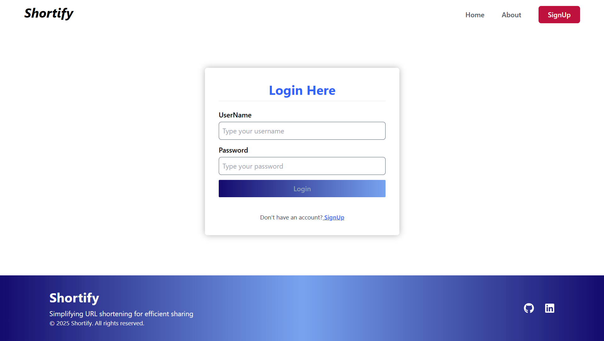
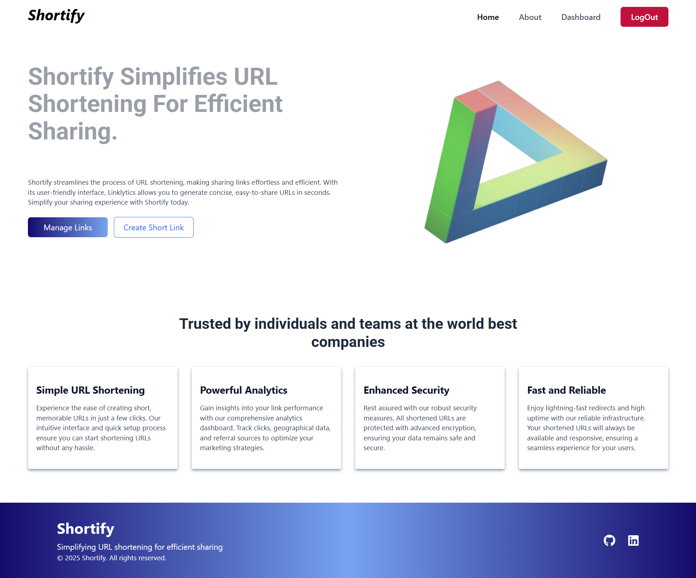
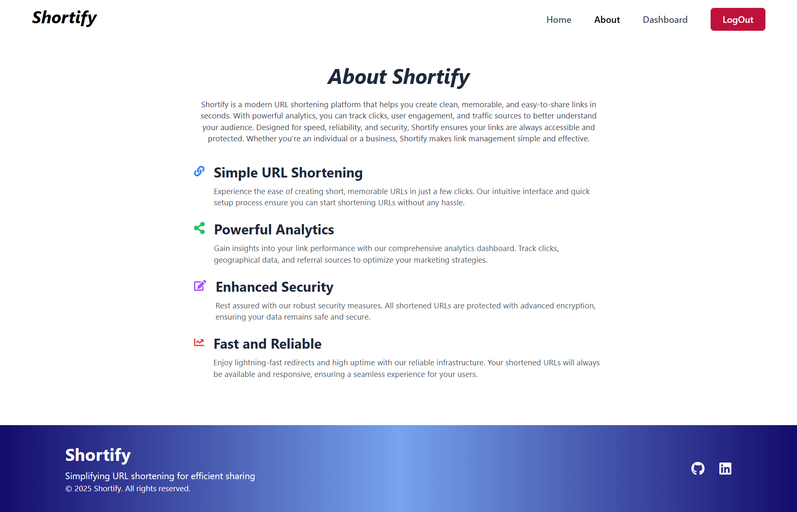
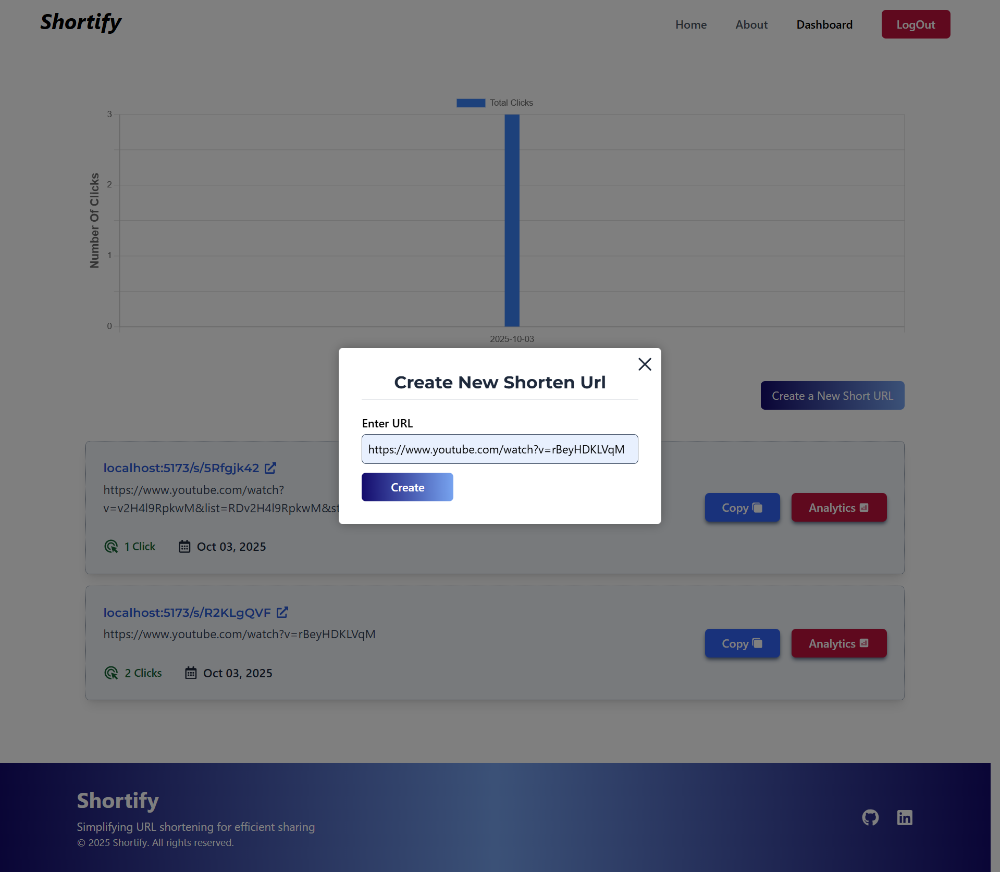
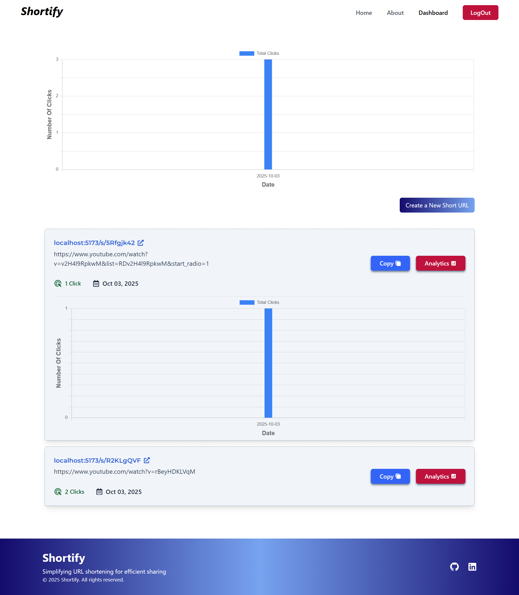

# 🔗 UrlShortener: Real-Time URL Shortening and Analytics Platform

**UrlShortener** is a powerful, modern URL shortening service that allows users to instantly generate short links, securely manage them, and track comprehensive real-time analytics. Built with a robust Spring Boot backend and a responsive React frontend, UrlShortener is designed to be fast, scalable, and user-friendly.

## 📚 Table of Contents

- [Overview](#overview)
- [Key Features](#key-features)
- [Tech Stack](#tech-stack)
- [Getting Started](#getting-started)
- [Screenshots](#screenshots)
- [Contributions](#contribution)
- [License](#license)
- [Author](#author)

## Overview

UrlShortener provides a complete solution for link management. Beyond just shortening long URLs, it offers detailed, real-time insights into link usage, including the total number of clicks and individual user interactions. The platform ensures a personalized and secure experience through full user authentication and a modern, fast user interface.

## Key Features

- **✅ Shorten Links:** Instantly generate concise, shareable short URLs for any long link.
- **📈 Analytics Dashboard:** Access a powerful dashboard to track the performance of every link, showing the total number of clicks.
- **👤 User Tracking:** Monitor granular link usage, tracking individual clicks associated with authenticated users.
- **🔒 User Authentication:** Secure login and signup functionality powered by JWT for a personalized and private link management experience.
- **✨ Modern UI:** A smooth, reactive frontend built with ReactJS for an excellent user experience.
- **🚀 Fast & Scalable:** A robust and efficient backend powered by Spring Boot ensures high performance and scalability.

## Tech Stack

UrlShortener is a full-stack application leveraging modern, industry-standard technologies:

### Backend (API)

| Technology             | Purpose                                                                                        |
| :--------------------- | :--------------------------------------------------------------------------------------------- |
| **Spring Boot**        | Core framework for the RESTful API, providing speed and stability.                             |
| **Spring Security**    | Handling authorization, user authentication, and securing endpoints.                           |
| **JWT Authentication** | Secure, stateless authentication for API communication.                                        |
| **MySQL/PostgreSQL**   | Relational database for persistence of short links, long URLs, user data, and click analytics. |

### Frontend (UI)

| Technology       | Purpose                                                                          |
| :--------------- | :------------------------------------------------------------------------------- |
| **ReactJS**      | Library for building the responsive and dynamic Single Page Application (SPA).   |
| **React Router** | Managing client-side routing and navigation within the application.              |
| **Axios**        | Efficient, promise-based HTTP client for communicating with the Spring Boot API. |

### DevOps

| Technology                      | Purpose                                                                                                                                     |
| :------------------------------ | :------------------------------------------------------------------------------------------------------------------------------------------ |
| **Docker**                      | Containerization platform to package applications with all dependencies, ensuring consistency across environments.                          |
| **Docker Compose**              | Tool for defining and managing multi-container Docker applications using a single configuration file.                                       |
| **Kubernetes (K8s)**            | Container orchestration platform for automated deployment, scaling, and management of containerized applications.                           |
| **Jenkins**                     | Continuous Integration and Continuous Deployment (CI/CD) automation server for building, testing, and deploying applications.               |
| **Terraform**                   | Infrastructure as Code (IaC) tool for provisioning and managing cloud resources in a consistent and automated way.                          |
| **Ansible**                     | Configuration management and automation tool for provisioning servers and deploying applications efficiently.                               |
| **Prometheus**                  | Monitoring and alerting toolkit designed for collecting and querying time-series metrics from applications and infrastructure.              |
| **Grafana**                     | Visualization and analytics platform used to create dashboards and monitor metrics collected by Prometheus and other sources.               |
| **Google Cloud Platform (GCP)** | Cloud service provider used for hosting, scaling, and managing applications and infrastructure.                                             |
| **Render**                      | Cloud platform for hosting and deploying web applications and services with automated builds and scalability.                               |
| **Vercel**                      | Frontend deployment platform optimized for React and other JavaScript frameworks, enabling fast global delivery and easy CI/CD integration. |

## Getting Started

Follow these steps to set up and run UrlShortener locally.

### Prerequisites

- Java Development Kit (JDK 17 or newer)
- Node.js and npm (or yarn)
- A running instance of MySQL or PostgreSQL database.
- Maven (for Spring Boot build)

### 1\. Database Setup

1. Update the database connection properties in the backend's `application.properties` file with your credentials:
   ```yaml
   spring.datasource.url: jdbc:postgresql://localhost:5432/urlshortener_db
   spring.datasource.username: your_db_user
   spring.datasource.password: your_db_password
   ```

### 2\. Backend Setup

1. Navigate to the `backend` directory (or equivalent).
2. Build the project using Maven:
   ```bash
   mvn clean install
   ```
3. Run the application:
   ```bash
   java -jar target/urlshortener-backend-*.jar
   # OR if using an IDE like IntelliJ, run the main application class.
   ```
   The API should start running on `http://localhost:9090`.

### 3\. Frontend Setup

1. Navigate to the `frontend` directory (or equivalent).
2. Install the dependencies:
   ```bash
   npm install
   ```
3. Start the development server:
   ```bash
   npm run dev
   ```
   The React application should open in your browser at `http://localhost:5173` (or the configured port).

## Screenshots

  
   
   
   
 
